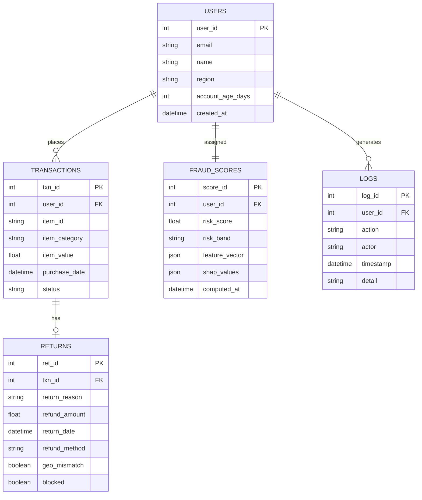

# Explainable AI-Powered Returns Fraud Detection Dashboard

A machine learning system for detecting, scoring, and explaining fraudulent return behavior in e-commerce platforms.

---

## Table of Contents

- [Project Overview](#project-overview)
- [Key Features](#key-features)
- [System Architecture](#system-architecture)
- [Machine Learning Approach](#machine-learning-approach)
- [Database Schema (ER Diagram)](#database-schema-er-diagram)
- [UML Component Diagram](#uml-component-diagram)
- [ML Pipeline](#ml-pipeline)
- [Dashboard Metrics](#dashboard-metrics)
- [User Risk Categorization](#user-risk-categorization)
- [Logs and Monitoring](#logs-and-monitoring)
- [Why This Project](#why-this-project)
- [Future Enhancements](#future-enhancements)
- [Tech Stack](#tech-stack)
- [Project Structure](#project-structure)

---

## Project Overview

E-commerce return fraud costs the retail industry billions annually. Unlike payment fraud, return fraud is difficult to detect because every individual return is technically a legitimate business action — the pattern of behavior across time is what reveals abuse.

Common fraud patterns include:

- **Serial returners** — customers who systematically return most purchases
- **Wardrobing** — purchasing items for temporary use and returning them
- **Receipt manipulation** — claiming refunds for items not purchased or at inflated values
- **High-value item abuse** — repeatedly returning expensive goods under policy loopholes
- **Geolocation mismatch** — returns initiated from locations inconsistent with purchase origin

Rule-based systems fail here because fraudulent users exploit the system just within policy limits. What is needed is an anomaly detection system that learns behavioral deviation and explains why a specific user is flagged — enabling investigators to act without blindly trusting a black-box score.

This system combines **Isolation Forest anomaly detection**, **behavioral feature engineering**, and **SHAP-based explainability** to produce audit-ready, human-understandable fraud risk profiles.

---

## Key Features

| Feature | Description |
|---|---|
| CSV Transaction Ingestion | Upload raw transaction logs via dashboard |
| Real-Time User Search | Look up any user by ID or email for instant profile |
| Risk Score (0-100) | Normalized anomaly score per user |
| Risk Band Classification | Automatic Low / Medium / High categorization |
| Total Financial Loss | Estimated fraud-attributed refund value |
| Loss Recovery Tracking | Tracks blocked or reversed refunds |
| Fraud Distribution Chart | Visual breakdown of fraud vs. legitimate users |
| Top Fraud Risk Factors | SHAP-derived per-user explanation of flag reasons |
| User Investigation Panel | Full behavior profile for any searched user |
| Behavioral Timeline | Chronological return and purchase activity |
| Audit Logs | Every system and user action is recorded |
| Risk Sensitivity Slider | Adjustable threshold for flagging aggressiveness |
| Behavioral Heatmap | Cluster-level view of fraud risk concentration |
| Return Frequency Tracking | Rate of returns relative to total purchases |
| High-Value Item Detection | Tracks returns skewed toward expensive product categories |

---

## System Architecture

```
+---------------------------------------------------------------+
|                         FRONTEND                              |
|  Streamlit Dashboard (Python)                                 |
|  - Risk Overview Panel     - Heatmap Visualization           |
|  - User Search Panel       - Behavioral Timeline             |
|  - Risk Breakdown Charts   - Logs View                       |
|  - Threshold Slider        - Fraud Distribution Chart        |
+-------------------------------+-------------------------------+
                                |
                      REST API (HTTP/JSON)
                                |
+-------------------------------v-------------------------------+
|                          BACKEND                              |
|  FastAPI Application                                          |
|                                                               |
|  POST /api/upload        -> CSV ingestion                    |
|  GET  /api/users         -> User risk profiles               |
|  GET  /api/scores        -> Risk score retrieval             |
|  GET  /api/explain/{id}  -> SHAP explanations               |
|  GET  /api/logs          -> Audit log access                 |
|  POST /api/threshold     -> Sensitivity adjustment           |
|                                                               |
|  Auth Service (JWT)  |  Risk Score Service                   |
|  Logging Service     |  CSV Validation Service               |
+-------------------------------+-------------------------------+
                                |
                   Internal function calls
                                |
+-------------------------------v-------------------------------+
|                        ML ENGINE                              |
|  Feature Engineering Module                                   |
|  Isolation Forest Model                                       |
|  Risk Score Normalizer (0-100)                               |
|  Risk Band Classifier                                         |
|  SHAP Explainability Module                                   |
+-------------------------------+-------------------------------+
                                |
                     Read / Write operations
                                |
+-------------------------------v-------------------------------+
|                        DATA LAYER                             |
|  PostgreSQL Database                                          |
|  - users    - transactions    - returns                       |
|  - fraud_scores    - logs                                     |
|                                                               |
|  File Storage                                                 |
|  - /data/raw/        (uploaded CSVs)                         |
|  - /data/processed/  (feature vectors)                       |
+---------------------------------------------------------------+
```

**Request Flow**

```
User Action
  --> Streamlit Frontend (Python)
    --> FastAPI Backend  (auth + routing)
      --> ML Engine      (feature engineering + scoring)
        --> PostgreSQL   (persist results)
          --> Backend    (format API response)
            --> Frontend (render updated dashboard)
```

---

## Machine Learning Approach

### Feature Engineering

| Feature | Formula |
|---|---|
| Return Frequency | total_returns / total_orders |
| Return Velocity (30d) | count of returns in last 30 days |
| Avg Time-to-Return | mean(return_date - purchase_date) in days |
| High-Value Item Ratio | high_value_returns / total_returns |
| Category Repetition Score | entropy of returned product categories |
| Account Age | days since account creation |
| Geolocation Mismatch Count | returns from IP regions != purchase region |
| Refund Pattern Consistency | variance in refund method across returns |

### Anomaly Detection

**Primary Model: Isolation Forest**

Isolation Forest partitions the feature space randomly. Anomalous users are isolated in fewer steps, producing higher anomaly scores. No ground-truth labels are required; contamination parameter controls expected fraud proportion.

**Optional Supervised Layer: Logistic Regression**

If labeled fraud data is available, Logistic Regression is trained on engineered features to calibrate the final score.

**Imbalanced Data Handling**

- SMOTE for supervised path
- Class weighting in Logistic Regression
- Contamination tuning in Isolation Forest

### Risk Score Formula

```
Raw Anomaly Score   <- Isolation Forest decision_function output
Normalized Score    <- MinMax scaling to [0, 100]

Final Risk Score = weighted_sum(
    0.40 * normalized_anomaly_score,
    0.20 * return_frequency_score,
    0.15 * high_value_item_score,
    0.15 * geolocation_risk_score,
    0.10 * timing_anomaly_score
)
```

### Explainability (SHAP)

SHAP TreeExplainer computes per-user feature contributions. The top contributing factors are stored and surfaced in the investigation panel.

```
User flagged at score 84:
  + Return Frequency:        +32  (dominant contributor)
  + High-Value Item Ratio:   +18
  + Geolocation Mismatch:    +14
  + Avg Time-to-Return:      +12
  - Account Age:              -8  (mitigating factor)
```

---

## Database Schema (ER Diagram)

### Mermaid ER Diagram



### ASCII ER Diagram

```
+-------------------+        +----------------------+
|      USERS        |        |     TRANSACTIONS     |
|-------------------|        |----------------------|
| user_id     PK    |1------*| txn_id        PK     |
| email             |        | user_id       FK     |
| name              |        | item_id              |
| region            |        | item_category        |
| account_age_days  |        | item_value           |
| created_at        |        | purchase_date        |
+-------------------+        | status               |
         |                   +----------+-----------+
         |                              |
         | 1                            | 1
         |                             |
         v *                            v 0..1
+-------------------+        +----------------------+
|   FRAUD_SCORES    |        |       RETURNS        |
|-------------------|        |----------------------|
| score_id    PK    |        | ret_id        PK     |
| user_id     FK    |        | txn_id        FK     |
| risk_score        |        | return_reason        |
| risk_band         |        | refund_amount        |
| feature_vector    |        | return_date          |
| shap_values       |        | refund_method        |
| computed_at       |        | geo_mismatch  BOOL   |
+-------------------+        | blocked       BOOL   |
         |                   +----------------------+
         | 1
         |
         v *
+-------------------+
|       LOGS        |
|-------------------|
| log_id      PK    |
| user_id     FK    |
| action            |
| actor             |
| timestamp         |
| detail            |
+-------------------+
```

**Relationships**

| Relationship | Type |
|---|---|
| USERS to TRANSACTIONS | One-to-Many |
| TRANSACTIONS to RETURNS | One-to-Zero-or-One |
| USERS to FRAUD_SCORES | One-to-One |
| USERS to LOGS | One-to-Many |

---

## UML Component Diagram

```
+---------------------+
| Streamlit Frontend  |
| (Python)            |
|---------------------|
| Dashboard Pages     |
| Chart Components    |
| Search Panel        |
| Threshold Control   |
+----------+----------+
           |
           | HTTP REST (JSON)
           |
+----------v----------+
|  FastAPI Backend    |
|  (Python)           |
|---------------------|
| Upload Controller   |
| User Controller     |
| Score Controller    |
| Explain Controller  |
| Logs Controller     |
| Auth Middleware     |
+----+----------+-----+
     |          |
     |          | SQL ORM
     |          |
     |    +-----v-----------+
     |    |    Database      |
     |    |-----------------|
     |    | users            |
     |    | transactions     |
     |    | returns          |
     |    | fraud_scores     |
     |    | logs             |
     |    +-----------------+
     |
     | Internal call
     |
+----v------------------+
|      ML Engine        |
|-----------------------|
| FeatureEngineer       |
| IsolationForest       |
| ScoreNormalizer       |
| RiskBandClassifier    |
| SHAPExplainer         |
+-----------------------+
```

---

## ML Pipeline

```
+----------------------+
|  Raw CSV Upload      |  <- Admin uploads transaction log
+----------+-----------+
           |
           v
+----------+-----------+
|  Data Validation     |  <- Schema check, null removal, dedup
+----------+-----------+
           |
           v
+----------+-----------+
|  Feature Engineering |  <- Compute behavioral features per user
+----------+-----------+
           |
           v
+----------+-----------+
|  Train / Test Split  |  <- 80/20 split on user-level data
+----------+-----------+
           |
           v
+----------+-----------+
|  Isolation Forest    |  <- Unsupervised anomaly detection
+----------+-----------+
           |
           v
+----------+-----------+
|  Anomaly Scores      |  <- Raw decision_function output
+----------+-----------+
           |
           v
+----------+-----------+
|  Score Normalization |  <- Map to 0-100 range
+----------+-----------+
           |
           v
+----------+-----------+
|  Risk Band Assignment|  <- Low / Medium / High
+----------+-----------+
           |
           v
+----------+-----------+
|  SHAP Explainability |  <- Per-user feature contribution
+----------+-----------+
           |
           v
+----------+-----------+
|  Store to Database   |  <- Persist fraud_scores + logs
+----------+-----------+
           |
           v
+----------+-----------+
|  Dashboard Render    |  <- Streamlit frontend renders updated dashboard
+----------------------+
```

---

## Dashboard Metrics

| Metric | Calculation |
|---|---|
| Total Transactions | COUNT(*) from transactions table |
| Total Fraud Detected | COUNT(users) WHERE risk_band = 'High' |
| Total Financial Loss | SUM(refund_amount) WHERE risk_band = 'High' |
| Total Loss Recovered | SUM(refund_amount) WHERE blocked = TRUE |
| Fraud Rate % | (High Risk Users / Total Users) * 100 |
| Risk Accuracy | Precision = TP / (TP + FP) on labeled validation set |

---

## User Risk Categorization

```
Score Range    Band           Recommended Action
-------------------------------------------------------------------
0  - 40        Low Risk       No action. Standard monitoring.
41 - 70        Medium Risk    Flag for manual review. Soft hold.
71 - 100       High Risk      Escalate. Block refund. Investigate.
```

**Investigator Workflow**

1. Search a user by ID or email from the dashboard
2. View risk score, band, and top SHAP contributing factors
3. Review behavioral timeline — return dates, amounts, item categories
4. Read audit logs for all historical actions on the account
5. Decide to clear, escalate, or block based on evidence

The Medium band exists specifically to prevent direct auto-blocking of borderline cases, reducing false positives and supporting fair treatment.

---

## Logs and Monitoring

| Event Type | What is Logged |
|---|---|
| User return submitted | Timestamp, refund amount, method, geo-data |
| ML pipeline run | Start time, end time, total users scored |
| Threshold change | Old value, new value, admin ID |
| User flagged | Score, band, top SHAP factors |
| Investigator search | Admin ID, searched user ID, timestamp |
| Refund blocked | User ID, amount, blocking reason |
| Admin login | Admin ID, IP address, timestamp |

Logs serve as an audit trail for compliance, model accountability, and fraud dispute resolution.

---

## Why This Project

| Aspect | Detail |
|---|---|
| Hybrid Detection | Combines rule-free anomaly detection with optional supervised classification |
| Explainable AI | Every score includes a human-readable factor breakdown via SHAP |
| Sensitivity Control | Threshold slider allows operational tuning without re-training |
| Behavioral Focus | Features derived from behavioral patterns, not just transaction values |
| Fairness by Design | Medium band prevents over-flagging; explainability enables appeals |
| Enterprise Structure | Modular, layered architecture ready for production extension |
| No Black Box | Every flagged user can be audited end-to-end through logs and SHAP output |

---

## Future Enhancements

| Enhancement | Description |
|---|---|
| Real-Time Streaming | Kafka-based event stream for live fraud detection |
| Graph-Based Detection | Graph neural networks to detect fraud rings and collusive networks |
| Deep Learning | LSTM sequence models for temporal behavioral pattern detection |
| Auto-Threshold Optimization | Bayesian or RL-based dynamic threshold tuning |
| Federated Detection | Cross-merchant fraud signal sharing without data exposure |
| Explainability UI | Interactive SHAP waterfall plots directly in the dashboard |

---

## Tech Stack

| Layer | Technology |
|---|---|
| Frontend | Python, Streamlit, Plotly, Folium |
| Backend | Python, FastAPI |
| ML | scikit-learn, SHAP, pandas, numpy |
| Database | PostgreSQL |
| Auth | JWT (PyJWT) |
| Deployment | Docker, Docker Compose |

---

## Project Structure

```
fraud-detection-dashboard/
|-- dashboard/                     # Streamlit frontend (Python)
|   |-- app.py                     # Main Streamlit entry point
|   |-- pages/
|   |   |-- overview.py            # Risk overview and metrics
|   |   |-- investigate.py         # User investigation panel
|   |   |-- heatmap.py             # Behavioral heatmap
|   |   |-- logs.py                # Audit logs view
|   |-- components/
|   |   |-- risk_chart.py          # Plotly risk breakdown chart
|   |   |-- user_search.py         # Search widget
|   |   |-- threshold_slider.py    # Sensitivity control
|   |-- requirements.txt
|
|-- api/                           # FastAPI backend (Python)
|   |-- main.py                    # FastAPI entry point
|   |-- routers/                   # upload, users, scores, explain, logs
|   |-- services/                  # risk_service, auth, logger
|   |-- ml/                        # feature_engineering, model, scorer, explainer
|   |-- models/                    # schemas, db connection
|   |-- requirements.txt
|
|-- data/
|   |-- raw/                       # Uploaded CSVs
|   |-- processed/                 # Feature vectors
|
|-- docker-compose.yml
|-- README.md
```

---

*Built for hackathon submission — engineering-first, explainability-driven, production-minded.*
